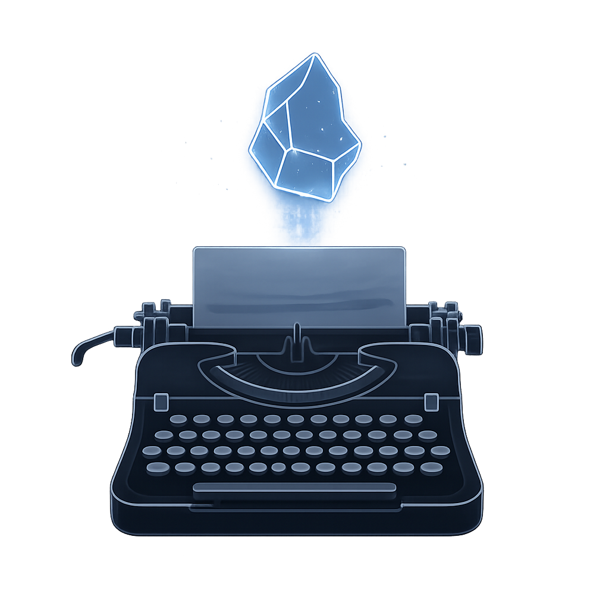
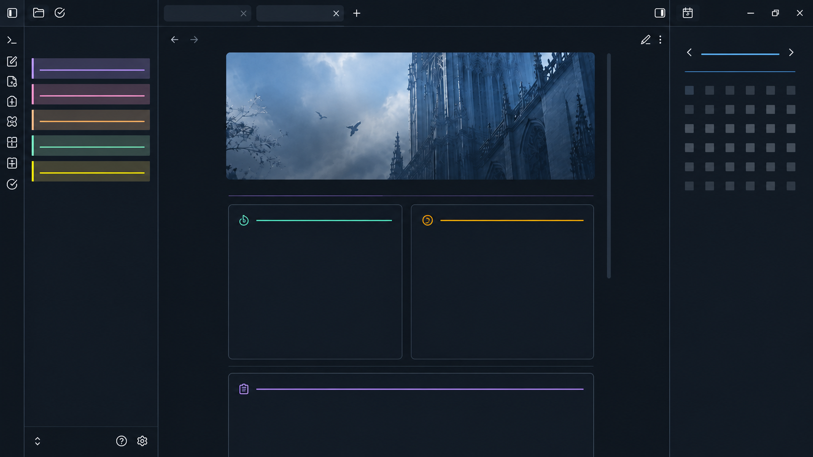
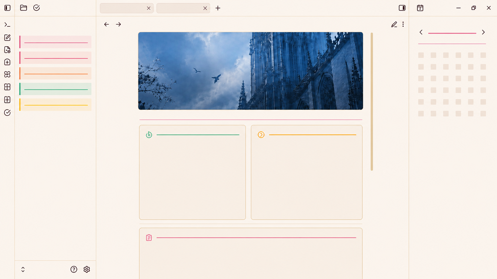

<h1 align="center">
  
  
Coldwriter
 

  
<em>"The best writing is cold"</em>
  

</h1>

---

## 🖼️ Gallery

  
  

Screenshots last updated <b>2026-07-25</b>

---

## 🗃️ Overview

> [!IMPORTANT]
> **Coldwriter** is a structured **Vault** built as a foundation for learning **writing** and working with **Obsidian**.
> It's meant to support:
>
> - Long-form manuscripts and long-form writing in general
> - Journaling, studying, and writing practice
> - A low-friction daily workflow

### 📖 Vault Systems

- **Long-form**
- **Journaling and a simple tracker**
- **Atomic notes / Zettelkasten-style capture**
- **Project and decision tracking**

### 📖 Plugins

#### Core

| Plugin          |
| ---------------- |
| backlink        |
| bases           |
| command-palette |
| editor-status   |
| file-explorer   |
| global-search   |
| outline         |
| properties      |
| word-count      |
| workspaces      |

---

#### Community

| Plugin                       | Repo                                                                                                           |
| ----------------------------- | ---------------------------------------------------------------------------------------------------------------- |
| beautytasks                  | [github.com/avnibilgin/BeautyTasks](https://github.com/avnibilgin/BeautyTasks)                                 |
| calendar                     | [github.com/liamcain/obsidian-calendar-plugin](https://github.com/liamcain/obsidian-calendar-plugin)           |
| cursor-smith                 | [github.com/sadsnake1/cursor-smith](https://github.com/sadsnake1/cursor-smith)                                 |
| note-mover-shortcut          | [github.com/bueckerlars/obsidian-note-mover-shortcut](https://github.com/bueckerlars/obsidian-note-mover-shortcut) |
| obsidian-icon-folder         | [github.com/FlorianWoelki/obsidian-iconize](https://github.com/FlorianWoelki/obsidian-iconize)                 |
| obsidian-languagetool-plugin | [github.com/Clemens-E/obsidian-languagetool-plugin](https://github.com/Clemens-E/obsidian-languagetool-plugin) |
| obsidian-linter              | [github.com/platers/obsidian-linter](https://github.com/platers/obsidian-linter)                               |
| quickadd                     | [github.com/chhoumann/quickadd](https://github.com/chhoumann/quickadd)                                         |
| simple-banner                | [github.com/eatcodeplay/obsidian-simple-banner](https://github.com/eatcodeplay/obsidian-simple-banner)         |
| storyline                    | [github.com/pixerojan/obsidian-storyline](https://github.com/pixerojan/obsidian-storyline)                                                                                                              |

---

## 🔧 Getting Started

> [!CAUTION]
> This vault is a personal template. Use whatever fits your workflow. Always review and tweak the config before relying on it.
> Recommended if you already know your way around Obsidian a bit.

---

### 1. Install Obsidian

Grab Obsidian for your platform:
Windows · Linux · macOS · Android · iOS

🔗 https://obsidian.md/download

---

### 2. Download the Latest Release

🔗 https://github.com/AntonAbbac/Coldwriter/releases/latest

---

### 3. Open the Vault

1. Open the Coldwriter folder in Obsidian
2. Enable Community Plugins
3. Reload the vault

That's it, you're set.

> [!WARNING]
> Read the vault docs before diving in so you actually get how the systems and info flow work. The home page inside the vault links out to all of it.
> Saves you headaches and repeat questions later.

---

## ☃️ Credits

A personal project made with a lot of care, for other Obsidian nerds.

---

## 📃 License

MIT License. See the LICENSE file for the fine print.

---
